# 10 Easy Steps to Connecting a Device to AWS IoT Core
This tutorial will now walk you through step by step for adding a "Thing" to AWS IoT Core. 
This example will demonstrate how to add your computer as a thing. However, the same process can be used to add a Raspberry Pi, Beaglebone, or any other device that is connected to the internet.

### Step 1: Create a AWS IoT Account and Clone this Repo
Sign up for an AWS Account. 
Clone this repository onto your device/computer.

### Step 2: Login to AWS IoT Core
Login to the AWS IoT Core page. This will take you to the AWS IoT Dashboard where you can add new devices.

### Step 3: Onboard a Thing
Click on the **Onboard** tab and select **Get Started**.
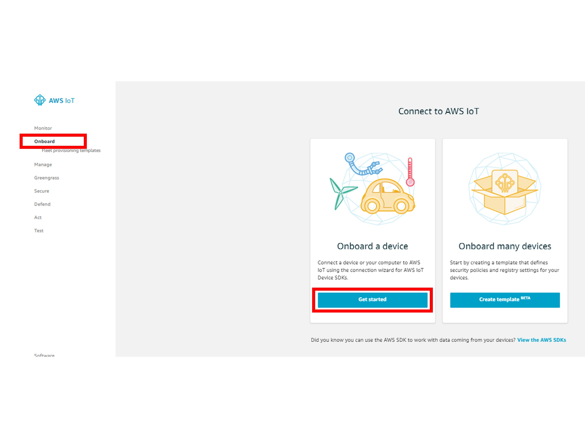 

### Step 4: Follow the Steps to Get Started and Select Appropriate AWS IoT SDK
Click **Get Started** and select your platform (Linux) and AWS IoT SDK (Python). Click **Next**.
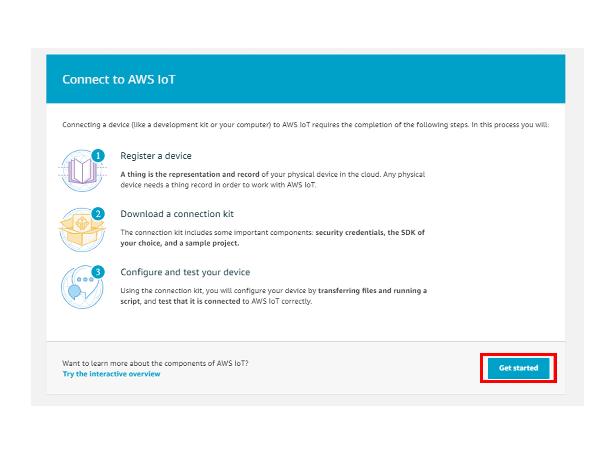
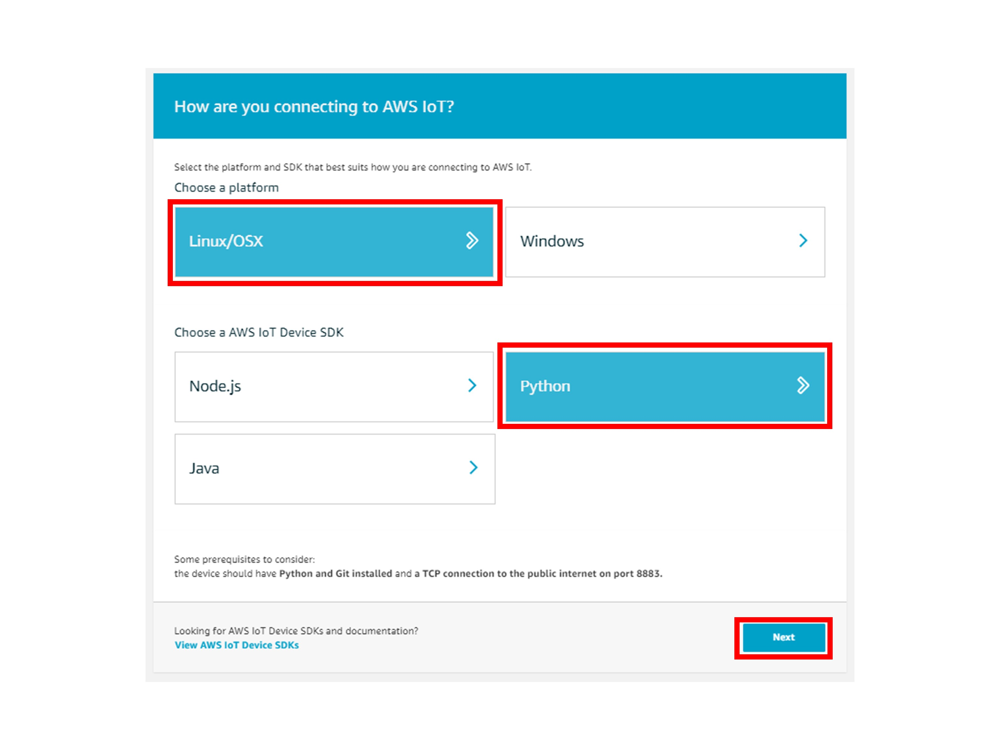

### Step 5: Enter the Thing Name
Enter the Thing name that will be atttributed to your thing. Click **Next**.
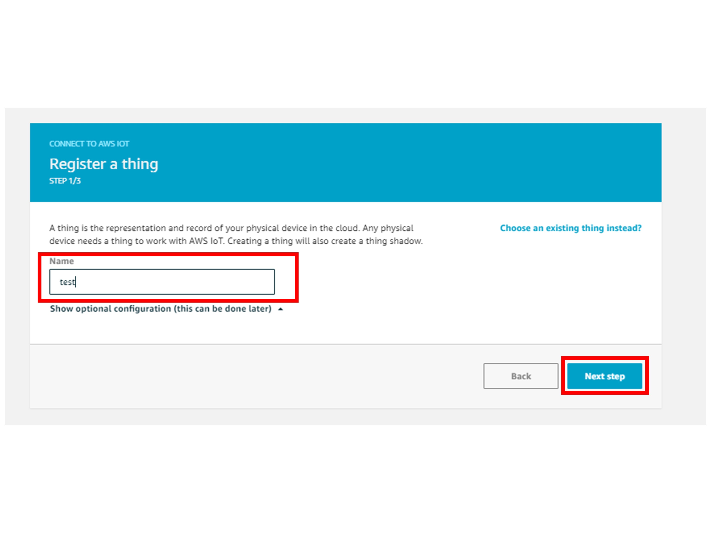

### Step 6: Install Connection Kit and Finish the Device Onboarding
Install the provided connection kit install this in the same folder as your cloned repository.
You will also need one more file for certifications -- the Root-CA file from Amazon. 
The file can be found [here](https://www.amazontrust.com/repository/AmazonRootCA1.pem).
Install this file into the same folder as this cloned repository, along with the other AWS certificates from the connection kit.
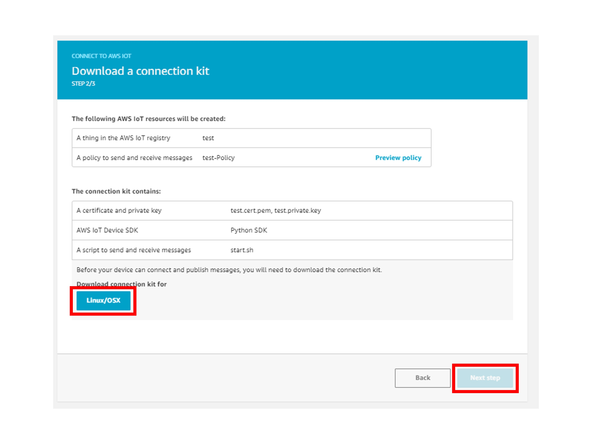
Click **Next**.

### Step 7: Modify the new Device's Policy Document
Now that you have created a new device in AWS IoT, click the **Manage > Things** tab and then select your newly created Thing.
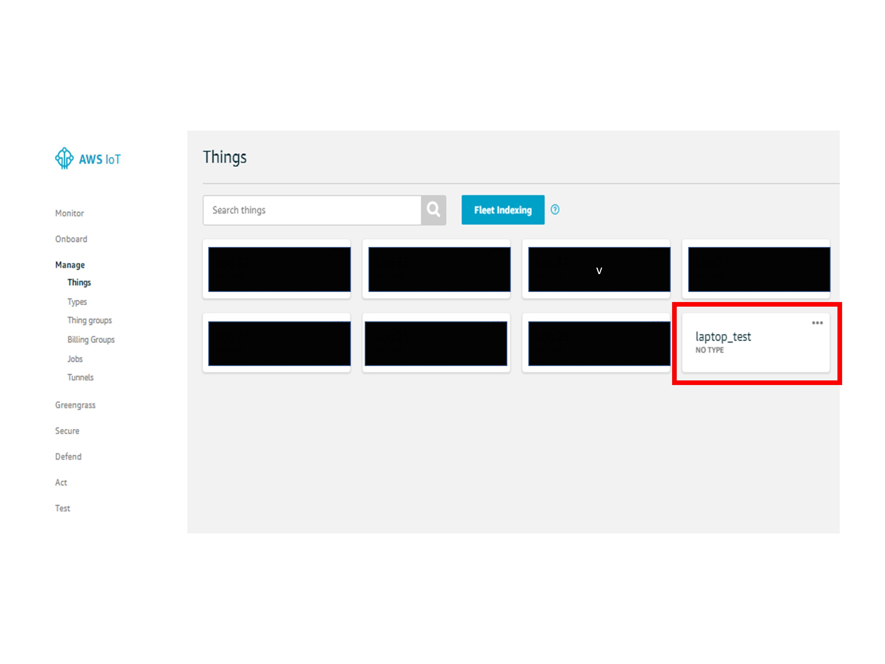
Once in the Thing settings view, select the **Security** tab, and select the only device certificate. 
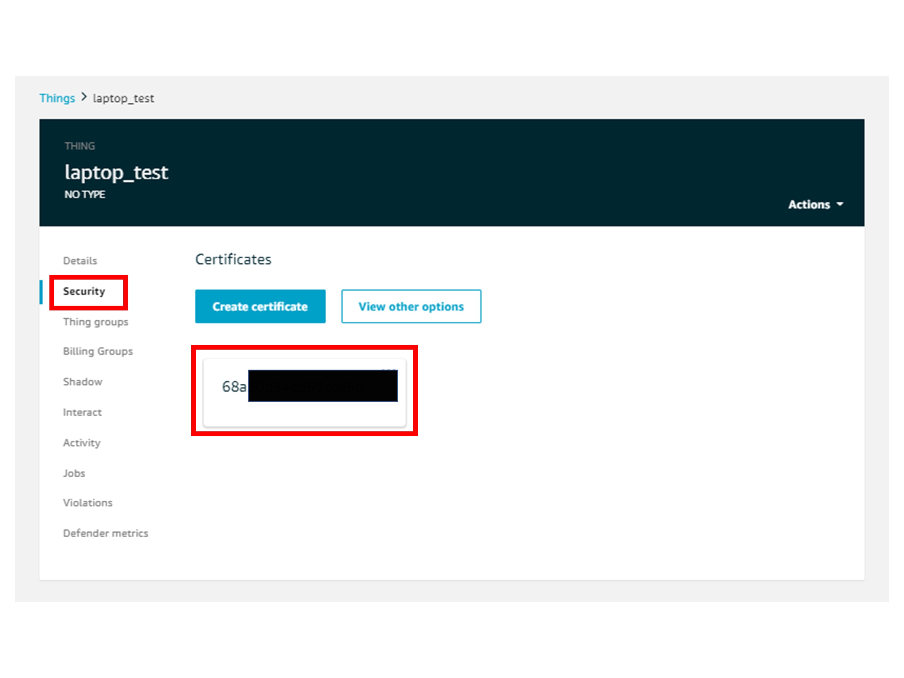
Once in the certificate settings, select the **Policies** tab and click on the ThingName-Policy document. 
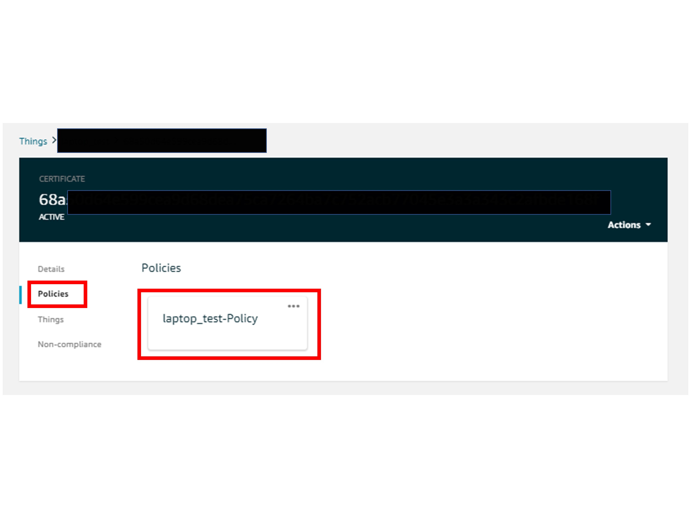
Once in the policy settings, select *Edit Document Policy*. Remove the default policy and replace it with the json that can be found in the thing_policy.json file, found in this repo.
It should look similar to the following picture.
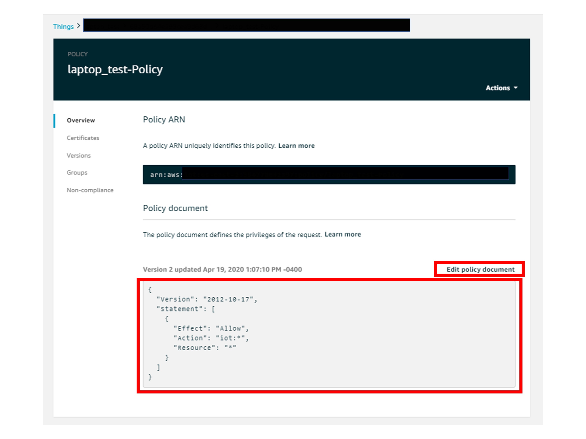

### Step 8: Edit the Source Code
Now that we have created a new thing and edited its policy documents in AWS, now it is time to modify the source code to allow our device to publish to the MQTT broker!
Let's edit the *easy_connect_tutorial.py* file in your cloned repo. First, edit the *MQTTParam* class with the path to the certificates and Root-CA file we installed in **Step 6**.
The `self.host` parameter is your AWS IoT endpoint. The endpoing address can be found in **Settings**, under *Custom Enpoints* header.
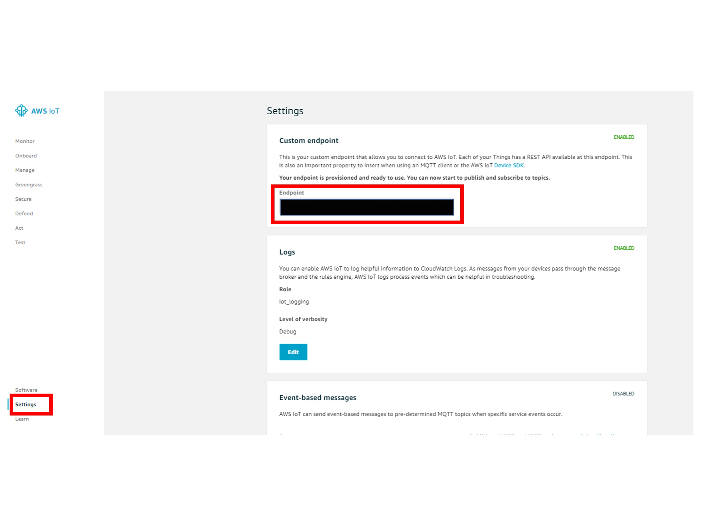
*Optional: you may also want to modify the publishing topic and the json message that your device will be sending. This can be done by simply modifying the `topic` and `JSONPayload` parameters.*

### Step 9: View your Published Messages in AWS IoT Core!
The final step is to open up the AWS MQTT Broker Test dashboard to view our messages as they are published to the MQTT Broker in real time. To do this, select the **Test** tab. Under *Subscription Topic*, enter the publishing topic from the source code (in this case `test`), or you can also enter `#`. Subscribing to `#` lets the MQTT broker know that you are subscribing to all topics in the broker.
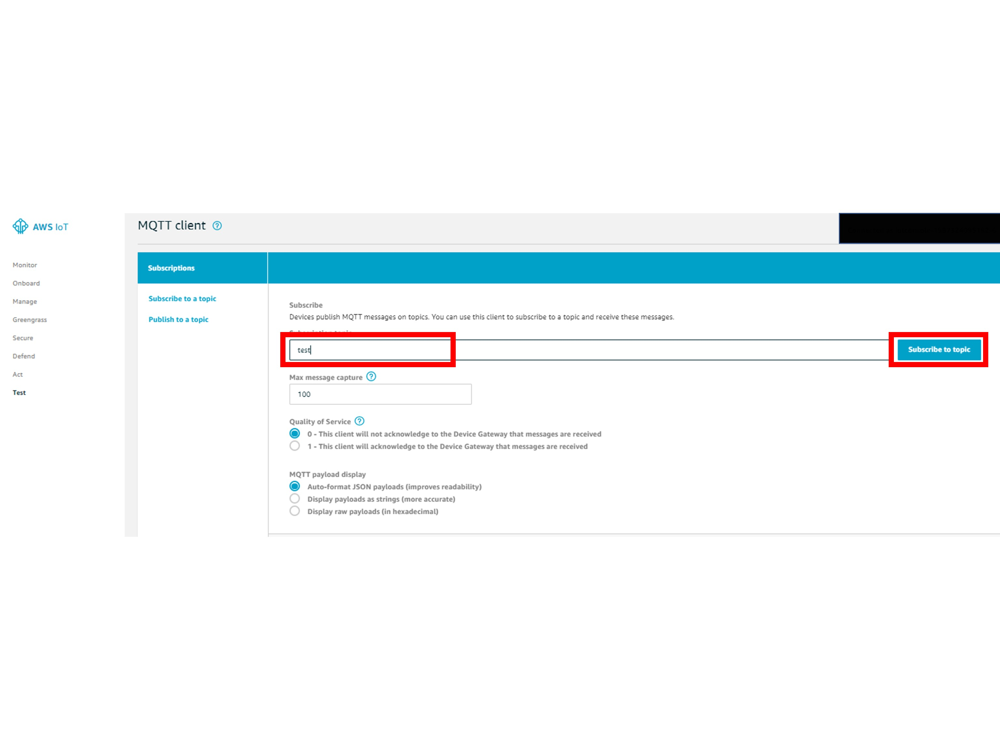

### Step 10: Run Source Code and Enjoy!
Once subscribed, run the *easy_connect_tutorial.py* program, and watch your messages get published in the MQTT broker.

# Finished!
If this tutorial helped you get ahead with AWS IoT, please **star** the repo. Any feedback, comments, or concerns are greatly appreciated!

